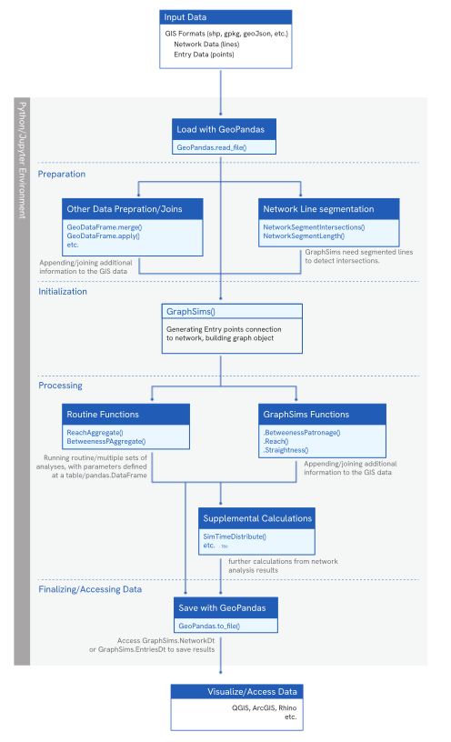

# Module Structure

Urban Network Analysis requires some ammount of setup and data to intialize. As an adaptation from Network Analysis, spatial context need to be taken accounted, with the base information for any analysis requires the circulation network, represented by lines/edges, and Entries that are activity nodes or entrances are represented by points.
During data entry, the points and network are not required to be connected or intersecting; As GraphSims will map the connection at the process of initialization.

The many branches of utility, use, and possible development of the set base features are numerous, with a lot of set/extrapolated metrics can be aquired/produced from the same/multiple calculation which also can be made from multiple calculation parameters.

  
@October2023