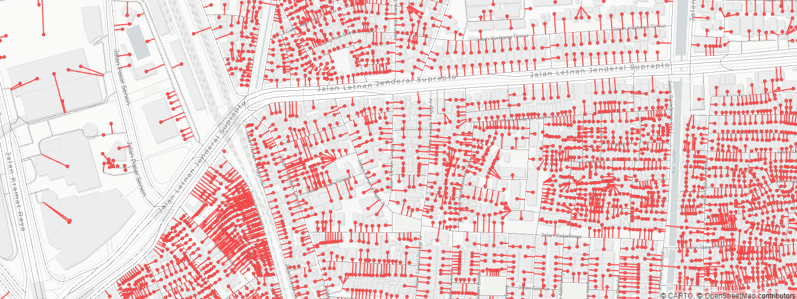
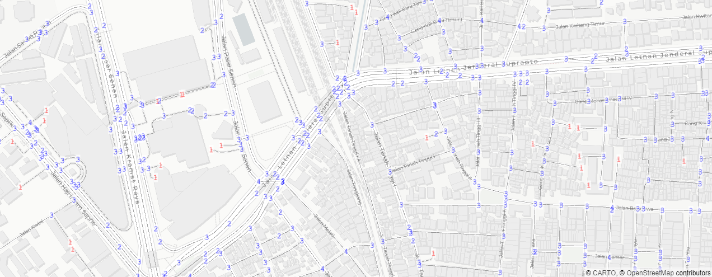
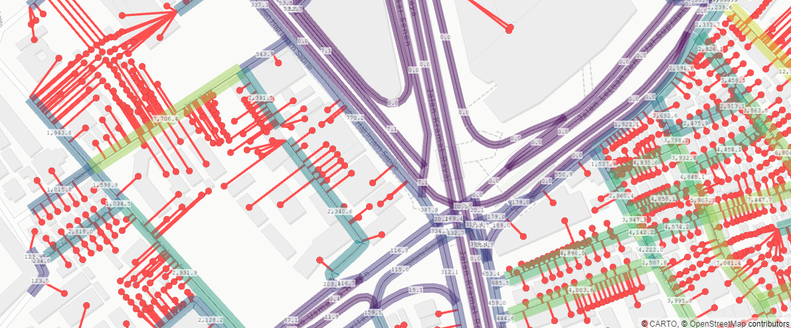

# Visualization functions

Some basic visualization functions based on pyDeck framework. functions and method stated below are part of GraphSims class.

### GraphSims <i>Functions</i>

#### Map_Show <i> func </i>
`#!python Map_Show(show='base', map_style='light', height=500, width=500, viewZoom=17, viewCenter=None)`

:   returns pydeck.bindings.deck.Deck<br>
    <i>pydeck.deck.Deck map</i>

    Builds, compiles, and returns pydeck interactive map of the network. it compiles all pydeck.bindings.layer.Layer kept on GraphSims.pdkLayers. Function can be directly used, it will run GraphSims.Map_BaseLayerInit() if no layers on GraphSims.pdfLayers are detected.

    !!! info "Showing Map"
        On jupyter environment, map can be directly shown if the last line of the cell is GraphSims.Map_Show(). Or, result can be kept as variable and shown with Deck.show() or further manipulation of the pydeck object.
    
    ##### Parameters

    :   <b>show</b> : str <i>default 'base'</i>
        :   options of map shown, a shortcut for GraphSims.Map_LayerAdd.
            other case 'junction' to run GraphSims.AddLayer('junction') to show junctions internally.
    
    :   <b>map_style</b> : str <i>default 'light'</i>
        :   options of pydeck basemaps.
    
    :   <b>height</b> : int <i>default 500</i>
        :   pydeck display height size
    
    :   <b>width</b> : int <i>default 100%</i>
        :   pydeck display width size in percent
    
    :   <b>viewZoom</b> : int <i>default 17</i>
        :   pydeck display view zoom
    
    :   <b>viewCenter</b> : None|list <i>default None</i>
        :   pydeck view center, list/tuple of size two floats, in lon, lat coordinates in degrees
    
    ##### Use Example
:   
    ```python
    nwSim = sna.GraphSims(dfNetworkSg, dfEntries, settings) # graphsim init

    nwSim.Map_Show()
    ```
    on jupyter this cell will show the map
    Example of default 'base' results:
    <br>
    ```python
    nwSim = sna.GraphSims(dfNetworkSg, dfEntries, settings) # graphsim init

    mapDeck = nwSim.Map_Show(base='junction')
    mapDeck.to_html('foo.html')
    mapDeck.show()
    ```
    Example map result for 'junction', note that dead ends are labelled red, and the shown numbers are the numbers of connected edges.
    <br>
    Accessing pydeck.bindings.deck.Deck for further capabilities.
    

    
#### Map_LayerAdd <i> func </i>
`#!python def Map_LayerAdd(self, layers:dict)`

:   returns void
    Add specified attribute and compiles to GraphSims.pdkLayers, with options for visualizations. to show map use Graphsims.Map_Show(). Will initialize Graphsime.Map_BaseLayerInit()

    !!! info "Same Attribute/Field name on Network and Entries dataframes"
        Some simulations/analysis adds attributes to both network and entries dataframe. Due to procurement of layer by using attribute name, both entries and network will be appended. to remove one of them, use pop.(the index of the layer) in Graphsims.pdkLayers and Graphsims.pdkLyrNm
    
    ##### Parameters

    :   <b>layers</b> : dict <i>required</i>
        :   Dictionary of key items are layers, and values of settings. For default view settings use None as value. (i.e. {'Btwn':None})
            the value are also in dictionary format, with settings available:
            :   'label' : bool <i>default: True</i>- to turn on/of labels of values
                'labelsize': int <i>default: 9</i>- size of label in points
            :   'colors': list/str <i>default: 'viridis'</i>color ramp in 2d list of rgb, or string 'viridis' or 'spectral' for feature symbology
            :   'vmin': None/float <i>default: None</i>- lower bound value for symbology distribution
            :   'vmax': None/float <i>default: None</i>- upper bound value for symbology distribution
            :   'distribution': str <i>default: 'decile'</i>- distribution by 'linear', 'quantile', or 'decile'
            :   'Omin': float <i>default: 1.0</i>- lower bound value for symbology size (for lines and points)
            :   'Omax': float <i>default: 5.0</i>- upper bound value for symbology size (for lines and points)
    
    ##### Use Example
:   
    ```python
    nwSim = sna.GraphSims(dfNetworkSg, dfEntries, settings) # graphsim init

    # adding layer
    nwSim.Map_AddLayer(
        {
            'junction':None,
            'Btwn':{'label':True, 'colors':'spectral', 'vmax':3000.0}
        }
    )

    nwSim.Map_Show()
    ```
    Example of betweeness results, with parameters set above.
    <br>

#### Related items/values in GraphSims to Mapping

:   #### .pdkLayers <i> list </i>

    :   list of pydeck Layer

        Compiled layers for pydeck visualization.

:   #### .pdkLyrNm <i> list </i>

    :   list of pydeck Layer names

        For NetworkDf based layers have '_Ntw' suffix, with label layers have '_NtwLbl' suffix
        For EntriesDf based layers have '_Ent' suffix, with label layers have '_EntLbl' suffix 

:   #### .pdkCenter <i> Shapely.Point in degrees (epsg:4326) </i>

    :   Center point for initial view center, on GraphSims.Map_BaseLayerInit(), coordinates will center on network df center using geopandas GeoDataFrame.geometry.unary_union.centroid. 


<br><br>
@September2024