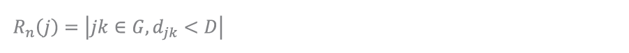
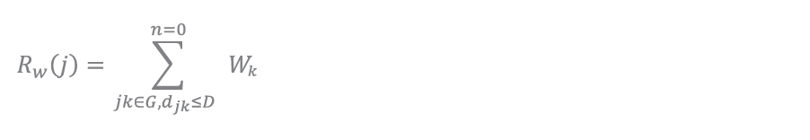
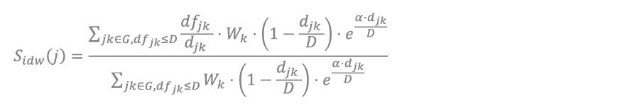
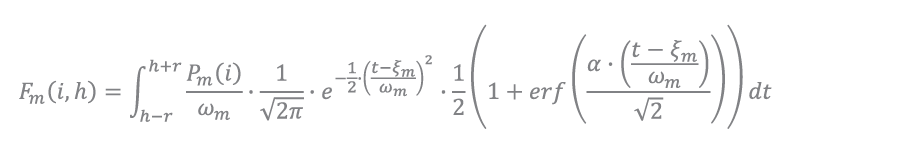

# Method Documentation

Documentation of calculation and processing methods used for the functions.

### Reach <i>Functions</i>

:   Reach function and its derivatives are summation/compilations of destinations within a given distance limit. This is used to represent the total (by number or by weight) from each origin points to selected destination points, determining what type of features are reachable and how many options there are.

    #### Reach Count

    :   The most basic form of the Reach function is the Reach Count, or mode 'N' in the library. Use for collecting the number of destinations options from origin point.

        

        where <i>jk</i> are pairs of origin-destinations within the network graph <i>G</i>, and <i>djk</i> which represents distance of travel within the graph compared less than or equal to the distance limit of <i>D</i>.

    #### Reach Weight Sum

    :   Reach Sum function which can be accessed with mode 'W' in the library, are reach function that returns the sum of a corresponding field value.[^1]

    [^1]: Concept and function is similar to Reach Centrality, Sevtsuk A., Meckonnen M. (2012), which also adopts from Bath, Handy et al. (2002) applied on network rather than Euclidian space.

        

        where in the condition of <i>jk</i> are pairs of origin-destinations within the network graph <i>G</i>, and <i>djk</i> which represents distance of travel within the graph compared less than or equal to the distance limit of <i>D</i>, the <i>Wk</i> Weight of the destination is summed.
    
    #### Reach Inverse Weight Distance with Marginal Utility

    :   Reach calculation function that applies weight sum accompanied with inverse weight distance and marginal utility. Developed for calculating weight with inverse distance (linear and exponent flexibility)[^2] as well as incorporating marginal utility[^3] concept.

    [^2]: from Franke (1982), adjusted from euclidean to network distance context.
    [^3]: Expressing subsequent values would diminish in added weighting, following marginal utility principal from F.Y. Edgeworth (1981).

        

        where the condition for summation are pairs of origin-destinations (<i>jk</i>) within the network graph <i>G</i>, and <i>djk</i> which represents distance of travel within the graph compared less than or equal to the distance limit of <i>D</i>, that are sorted ascending based on pair distance, where also the loop index (<i>n</i>) is less than or equal to loop limit of <i>N</i>. 

        To which the value for summation are the <i>Wk</i> Weight of the destination multiplied by normalized inverse distance with exponent component where α represents the exponent factor, followed by marginal multiplier (μ) to the power of its index (<i>n</i>).
        
        The function's additional utilities can be simplified wether to incorporate exponent of inverse distance and/or marginal utility, where the α value can be set to 0 to set the inverse distance funtion to linear; And μ can be set to 1 to disregard marginal utility.
    
### Straightness <i>Functions</i>

:   Straightness function represents the ratio between fly/cartesian distance over network distance to represent how direct a the shortest distance between origin and destinations are[^4], with values closer to 1.0 means a more direct network, where as smaller values represents more convoluted paths. The base function for straightness in the library is expressed in weighted average.

    [^4]: from Vragovic, Louis et al. (2005) and Porta et al (2005)

    

    where in the condition of <i>jk</i> are pairs of origin-destinations within the network graph <i>G</i>, and <i>dfjk</i> which represents distance of cartesian distance compared less than or equal to the distance limit of <i>D</i>, the <i>Wk</i> Weight of the destination multiplied by flight distance over network distance (<i>djk</i>) is summed. Which as a part of weighted sum is devided by the sum of destination weight with the same sum condition.

    variations of the function that are available in distance weighted and also inverse distance weighted, with the following elaboration:

    #### Straightness Distance Weight

    :   Distance weight functions to express higher weighting on further objects, where the scores of further objects in network are weighted higher in proportion to the search distance. Applied on the base function with the expression as

        

        where the distance weighting is based upon the network distance rather than the cartesian distance to emphasize further values.
    
    #### Straightness Inverse Distance Weight

    :   Inverse distance weight functions to express higher weighting on closer objects, where the scores of closer objects in network are weighted higher in proportion to the search distance. Applied on the base function with the expression as

        

        where the distance weighting is based upon the network distance rather than the cartesian distance to emphasize further values.

### Betweeness Patronage <i>Functions</i>

:   Betweeness Patronage is a weighted form of betweeness, where betweeness is a function for calculating number of paths going through a segment; Expressing how many paths going through that particular segment[^5]. the patronage element expresses that function with weighted elements of the total sum of distributed value from the origin, with weighted preference to set of destinations through their distance and weight.

    Calculating basic discrete footfall can be defined from the origin, how much capacity or discrete users it generates, plot their course into a set of destinations, each with different attraction weighting, and also the distances they have to cover to reach it on the circulation network. the closer the distance, the more luring it is, but with enough intrinsic attractiveness weighting, further features can also outweigh closer ones. To express this in mathematical terms, there are several factors and concepts to combine.

    [^5]: from Freeman (1977), expressing the importance of an edge in a network.

    

    where the sum from origin (<i>j</i>) in the set of origins (<i>J</i>) of the distributed value/patronage/capacity (<i>pj</i>). Multiplied by the weight ammount passing through the segment over the whole set of paths which is calculated by the sum of destination weights (<i>Wk</i>) over a distance multiplier of shortest distance between origin and destination (<i>djk min</i>) over the path distance (<i>djk</i>) in the power of 1 + exponent multiplier of α.

    Where the resulting value is the sum of function of paths that includes the segment divided by function of all possible paths, multiplied by the origin’s weight. Meaning, that segments on all part of possible path alternative will equate up to complete weight, that proves the function. Alternative paths, also known as detour ratio, is expressed by a float value of at least more than 1.0, where alternative pathways are still less than the closest path times detour ratio is still included in the summation.

    ??? note "detour ratios and multiple destinations"

        By adding detour ratio of 1.5 with exponent of 0.1, the results of the function branches into multiple paths, with the furthest distance taken is limited to 1.5 times of the shortest path found.

        As for multiple destinations, and different weight comes into play, although the smaller weighted destination is closer, most (60%) of walks are directed into the further located destination. There are some segments that houses multiple paths towards multiple destinations, which is summed as stated in the mathematical function.

### Time Distribution <i>Functions</i>

:   From Betweeness Patronage, a movement set can be somewhat determined, i.e. morning commute to available public transport, schools, etc. But this movement happen on a spread of time. Varying movement sets such as office-parking, commercial-parks, etc. have their spread and common distribution throughout the day (Sevtsuk, 2021). Another example can be obtained in real time, where on Melbourne, some corridors provide real-time pedestrian count data, and it shows that the spread of these movement have common peaks, and can be different on different locations depending on its location,

    The spread of this sets of movement, as most statistical distribution are on the natural world, is made from numerous overlapping and maybe even interacting asymmetrical distribution. As the total movement set amount is known, skewed normal distribution suits this context best (Azzalini, Capitanio, 2014), Since there are multiple movement sets, some summation function will also be applied. Furthermore, as the desired readability of results, the output value can be expressed in the amount of movement per a range of time, such as hour or several minutes, which the resulting function as

    

    Where the sum from <i>m</i> movement form a set of movements (<i>M</i>) of an integral within the range of time of the <i>Pm(i)</i> the segment's traffic of the movement on a nomal skew distribution function of that movement.

Further explanation on some contents can be found at:
<u>[SNAPyDocs methods](https://github.com/kevinsutjijadi/SNAPyDocs/tree/main/Methods)</u>
    
  
@November 2023