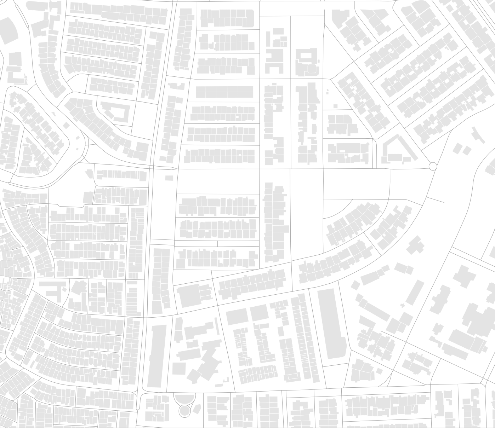
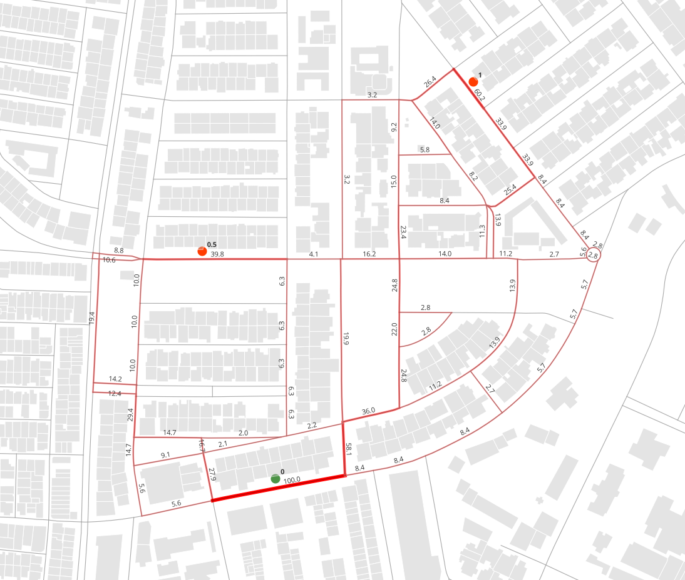
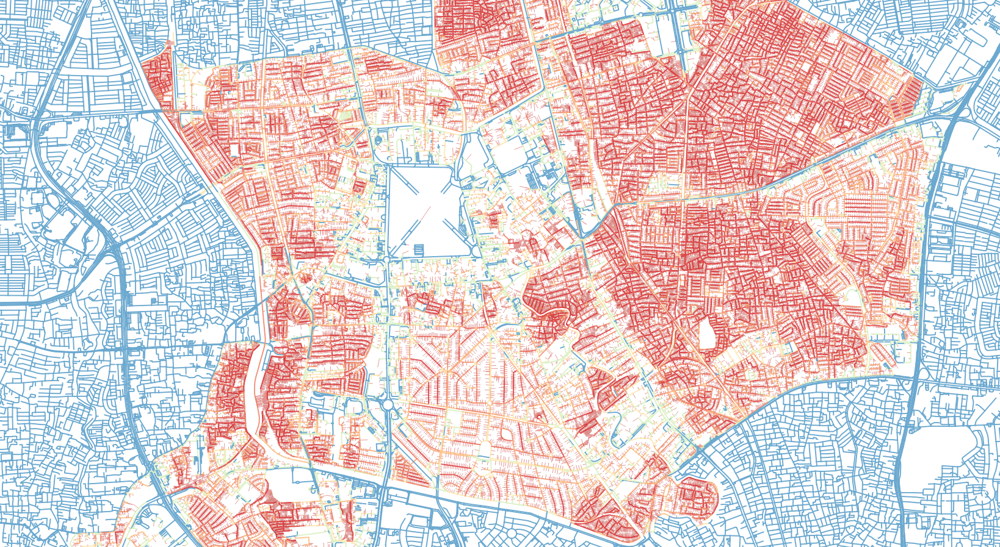

# Spatial Network Analysis Python Module

A package of spatial network analysis tools based on Geopandas dataframe and custom pathfinding (SGACy). Developed for regional scale spatial network analysis in Python environment for efficiency and better documentation. Fast performance utilizing Cython optimized algorithms and capabilities for multithreading using multiprocessing.pool. Most functions and tools are based from <u>[Urban Network Analysis Toolbox](https://cityform.mit.edu/projects/urban-network-analysis.html)</u> by MIT City Form Lab.

This is a documentation of the  <u>[:fontawesome-brands-github: SNAPy](https://github.com/kevinsutjijadi/SNAPy/tree/main)</u> library


  <!-- <iframe allowfullscreen sandbox  style="width: 100%; aspect-ratio:1;" src="assets/mapshow_jakpusl.png"></iframe> -->


sample output page [here](/Samples/Jakpus_Sample_1.html)

## Authorship
made by kevinsutjijadi @2023 Jakarta, Indonesia  
Last updated at 2024/09/27

## Installation
available on pypi<br>
latest version is 0.2.14<br>
<u>(https://pypi.org/project/snapy-toolbox/)</u>
```terminal
pip install snapy-toolbox
```
!!! danger "Only Runs on Windows and partial iOS" 
    On Windows only runs on python 3.11 & 3.12,<br>
    On iOS only runs on arm cpus and only on python 3.12

## Requirements 
- pandas >= 1.5.3
- geopandas >= 1.0.1
- pydeck >= 0.8.0
- scipy >= 1.10.0
- numpy >= 1.23.5
- shapely >= 2.0.0

## How to Use

As Spatial Network Analysis is a derivative development of the Social Science Network Analysis, the conceptualization of the network is adjusted where in the object, path network as the medium is supplemented by end nodes that represents buildings, activity points, or Point of interest of the movement. Note that the polygon data of the network pathway is required to be segmented at each intersection, with maximum inaccuracy tolarance of 1e-3 on junctions, further than that distance will not be detected as a junction. Entrance data are not required to be located on the network lines, as there are built in functions to map entrance points into the network.
Per Function documentation can be accessed in <u>[Documentation](https://kevinsutjijadi.github.io/SNAPyDocs/)</u>
Most analysis tools included will require a network, consisting of polygon geometry pathway networks, and point geometry entrances in any GIS format readable by geopandas. Some testdata is provided in this repository, which contains a part of Jakarta's network line obtained by OSM API, as the following:  




to use library, load data into geopandas geodataframe format, and use Graphsims to load the network information. It will compile and also append how the entrances connect to the network data.

```py
import geopandas as gpd
import SNAPy as sna

dfNetwork = gpd.read_file('NetworkClean.shp') # network dataframe
dfEntries = gpd.read_file('Features.gpkg', layer='Features') # entrance dataframe

nwSim = sna.GraphSims(dfNetwork, dfEntries) # main class for loading network data
```

to save the projected entries data, or access both network data or entrance data, both dataframes can be called and used as a normal Geopandas geodataframe

```py
nwSim.EntriesDf.to_file("file.gpkg", layer="entries", driver="GPKG", crs="EPSG:32748") # saving entries dataframe
nwSim.NetworkDf.to_file("file.gpkg", layer="network", driver="GPKG", crs="EPSG:32748") # saving network dataframe
```

Example analysis and result of the betweenness Patronage

```py
nwSim.BetweenessPatronage(OriWgt='Capacity', DestWgt='Weight', DetourR=1.2, SearchDist=1200, AlphaExp=0.1, RsltAttr='BtwnP')
```

with the resulting nwSim.Gdf as displayed below, can be directly shown on jupyter using nwSim.Map_AddLayer('BtwnP') and nwSim.Map_Show()

  
  
Performance is designed to be CPU optimized and RAM efficient, and more faster and reliable than former counterparts, but undeniably there are still a lot of room for development and streamlining process. Current build spends <30% (<60% on larger networks) of runtime within the pathfinding functions, SGACy, which is Cython based and quite optimized. Upon trial, using all cores of multithreading, process can be significantly faster than UNA Toolbox on Rhino and ArcGIS, upto 2 to 3 magnitude faster on runtime.

Sample run of 141k entry points as origin-destination on a 74k edges as network. number of pairings near 141k^2 (about 19mil pairings), with search distance of 400m and DetourRatio of 1.1. Multithreading process on i7-13700K without overclocking, the process took about 88s.

  

Further examples and use cases please check the <u>[Examples](/Pages/smpl/)</u> section

## References
- Sevtsuk, A., & Mekonnen, M. (2012). Urban Network Analysis Toolbox. International Journal of Geomatics and Spatial Analysis, 22(2), 287–305.
- Sevtsuk, A. (2014). Networks of the built environment. In D. Ofenhuber & C. Ratti (Eds.), Decoding the City: Urbanism in the Age of Big Data (p. 192). Birkhäuser.
- Barrat, A., et al. (2004) The architecture of complex weighted networks
- Haggett, P., & Chorley, J. C. (1969) Network Analysis in Geography. London: Butler & Tanner Ltd.
- Freeman, Linton (1977) A set of measures of centrality based on betweenness, Sociometry.
- Sevtsuk, A (2010) Path and Place: A Study of Urban Geometry and Retail Activity in Cambridge and Somerville, MA.
- Dijkstra, E W (1959) A note on two problems in connexion with graphs.

<br><br>
@September2024
